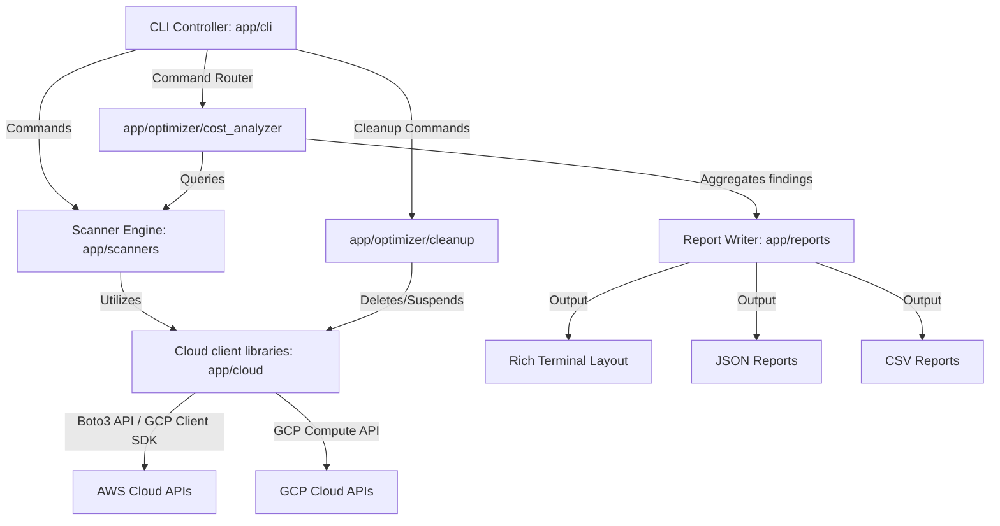

# Cloud Infrastructure Auditor & Cost Optimizer CLI (`cloud-auditor`)

`cloud-auditor` is an enterprise-grade, DevOps/FinOps-focused Command Line Interface (CLI) application developed in Python. It automatically audits cloud environments (AWS & GCP) for wasteful or misconfigured resources, estimates monthly and annual cost savings, generates structured reports (terminal tables, JSON, CSV), and provides interactive, safe cleanup triggers.

---

## 1. Project Overview

Cloud infrastructure waste is one of the largest unnecessary operating expenses for modern engineering teams. Unattached disk volumes, reserved but idle static public IPs, and running instances with zero to low CPU/network utilization cost organizations thousands of dollars.

`cloud-auditor` provides engineering, platform, and FinOps teams with a lightweight, secure tool to identify and optionally clean these resources.

---

## 2. Architecture Diagram

The application is structured into decoupled components following Clean Architecture principles:



---

## 3. Features

- **Multi-Cloud Scanner Engine**: Decoupled, polymorphic scanner structures supporting both AWS and Google Cloud Platform.
- **Resource Optimization Scans**:
  - **AWS EBS / GCP Persistent Disks**: Flags available (unattached) disk volumes and calculates monthly waste based on disk size and storage class.
  - **AWS Elastic IPs / GCP External IPs**: Flags reserved but unassociated static public IP addresses.
  - **AWS EC2 / GCP Compute Instances**: Evaluates historical utilization metrics (CPU Average < 5% and low network traffic over 14 days) using CloudWatch/Cloud Monitoring to flag idle servers.
- **FinOps Savings Model**: Incorporates standard pricing sheets to compute monthly and annual waste figures.
- **Interactive Cleanup Safeguards**:
  - Default **dry-run** output.
  - Explicit confirmation (`DELETE` input) required before resource termination or stopping.
- **Multi-Format Export**: Generates console tables, formatted JSON outputs, and flat CSV logs.

---

## 4. Installation

Ensure you have Python 3.12+ installed. 

### Local Development Setup

1. Clone or navigate to the project directory:
   ```bash
   cd "/Users/krushillukhi/Documents/KL Dev/Cloud Infrastructure Auditor & Cost Optimizer CLI"
   ```

2. Create and activate a virtual environment:
   ```bash
   python -m venv .venv
   source .venv/bin/activate
   ```

3. Install the package in editable mode with dependencies:
   ```bash
   pip install -r requirements.txt
   pip install -e .
   ```

Now, the command `cloud-auditor` will be globally accessible within your virtual environment.

---

## 5. Cloud Provider Configuration

### AWS Configuration

The CLI supports three authentication pathways (tried in order):
1. **Local Profile**: Reads credentials configured in standard locations (e.g. `~/.aws/credentials`). Load specific profile via config or CLI option:
   ```bash
   cloud-auditor scan --provider aws --config config/config.yaml
   ```
2. **Environment Variables**: Exports access keys:
   ```bash
   export AWS_ACCESS_KEY_ID="your_access_key"
   export AWS_SECRET_ACCESS_KEY="your_secret_access_key"
   export AWS_DEFAULT_REGION="us-east-1"
   ```
3. **STS AssumeRole**: Set the `assume_role_arn` in `config/config.yaml` to dynamically request temporary credentials.

### GCP Configuration

Authentication utilizes Google Application Default Credentials (ADC) or explicit service account keys:
- **Service Account Key**: Export path to JSON credentials:
  ```bash
  export GOOGLE_APPLICATION_CREDENTIALS="/path/to/sa-key.json"
  export GCP_PROJECT_ID="my-gcp-project"
  ```

---

## 6. Usage Examples & CLI Commands

### 1. Help Commands
Display top-level command routes and parameter options:
```bash
cloud-auditor --help
cloud-auditor scan --help
```

### 2. Scan Infrastructure
Audit AWS resources in multiple regions:
```bash
cloud-auditor scan --provider aws --region us-east-1,us-west-2
```

Audit GCP resources:
```bash
cloud-auditor scan --provider gcp --region us-central1
```

### 3. Export Reports
Specify custom report locations (saves copies in `/reports` folder by default):
```bash
cloud-auditor scan -p aws -j reports/my-report.json -v reports/my-report.csv
```

### 4. View Stored Reports
Render previous JSON reports in the professional console dashboard format:
```bash
cloud-auditor report reports/report_aws_20260713_140000.json
```

### 5. Config Inspection
Inspect current thresholds and configuration defaults:
```bash
cloud-auditor config
```

### 6. Resource Cleanup
Run a **dry-run** simulation of cleanup:
```bash
cloud-auditor cleanup --provider aws --region us-east-1
```

**Execute** resource deletion (triggers confirmation banner):
```bash
cloud-auditor cleanup --provider aws --region us-east-1 --execute
```

---

## 7. Configuration (`config/config.yaml`)

You can edit threshold parameters, observations duration, and local pricing schemas in [config.yaml](file:///Users/krushillukhi/Documents/KL%20Dev/Cloud%20Infrastructure%20Auditor%20&%20Cost%20Optimizer%20CLI/config/config.yaml):

```yaml
rules:
  ec2:
    cpu_threshold_percent: 5.0      # Idle threshold
    network_threshold_mbytes: 10.0   # Traffic threshold
    observation_days: 14            # Duration query window
  ebs:
    unused_days: 14                 # Flag unused disk threshold
```

---

## 8. Reports Output Examples

### Standard Terminal Report:
```
┌──────────────────────────────────────────────────────────┐
│ Cloud Infrastructure Auditor & Cost Optimizer CLI       │
│ Provider: AWS | Scanned At: 2026-07-13T08:30:00Z         │
└──────────────────────────────────────────────────────────┘
┌───────────────────┬──────────────────────┬─────────────────────┐
│ Flagged Resources │ Est. Monthly Savings │ Est. Yearly Savings │
├───────────────────┼──────────────────────┼─────────────────────┤
│ 2                 │ $58.50               │ $702.00             │
└───────────────────┴──────────────────────┴─────────────────────┘

Identified Waste & Recommendations
┌──────────────────────┬─────────────┬───────────┬───────────────────────────────────────────┬──────────────┬────────────────────────┐
│ Resource ID          │ Type        │ Region    │ Issue Details                             │ Monthly Waste│ Action Recommendation  │
├──────────────────────┼─────────────┼───────────┼───────────────────────────────────────────┼──────────────┼────────────────────────┤
│ vol-0683a6b57d       │ EBS         │ us-east-1 │ Unattached EBS Volume                     │ $8.00        │ Delete volume          │
│ i-0a8677fbc1d2       │ EC2 Instance│ us-east-1 │ Idle EC2 Instance (Avg CPU: 1.5%, Net: 3MB)│ $50.50       │ Stop or Delete Instance│
└──────────────────────┴─────────────┴───────────┴───────────────────────────────────────────┴──────────────┴────────────────────────┘
```

---

## 9. Testing

Run the test suite using pytest. The test suite incorporates Moto to mock AWS APIs securely without contacting actual endpoints.

```bash
pytest --cov=app tests/
```

Target test files include:
- `tests/test_auth.py`: AWS authentications and role assumptions validation.
- `tests/test_ebs_scanner.py`: EBS and Persistent disk unused space checks.
- `tests/test_ec2_scanner.py`: EC2 and GCE idle instances CPU/Network checks.
- `tests/test_cleanup.py`: Dry-run logic and AWS/GCP deletion pipelines.

---

## 10. Docker Support

### Build and Run with Docker

1. Build the local image:
   ```bash
   docker build -t cloud-auditor:latest .
   ```

2. Run a scan inside the container:
   ```bash
   docker run -v ~/.aws:/root/.aws:ro \
              -v $(pwd)/reports:/app/reports \
              cloud-auditor:latest scan --provider aws --region us-east-1
   ```

### Compose Setup
Run using docker-compose:
```bash
docker-compose run cloud-auditor scan --provider aws
```

---

## 11. Packaging into Binary (PyInstaller)

To compile the application into a standalone executable:

```bash
chmod +x build.sh
./build.sh
```

This compiles a single binary in `./dist/cloud-auditor` that can be run on target systems without a Python environment.

---

## 12. Future Improvements

- **Auto-tagging**: Add tags like `MarkedForDeletion` with timestamp during scans, and delete after grace period.
- **Notifications Integration**: Email or Slack alerts using webhooks when wasteful spend surpasses threshold.
- **Detailed GCP Pricing API Integration**: Query live GCP Billing API rather than fallback lookup maps.
- **Terraform State Drift Checks**: Cross-reference resources with Terraform state files to ensure deletion changes are recorded in Infrastructure-as-Code.
